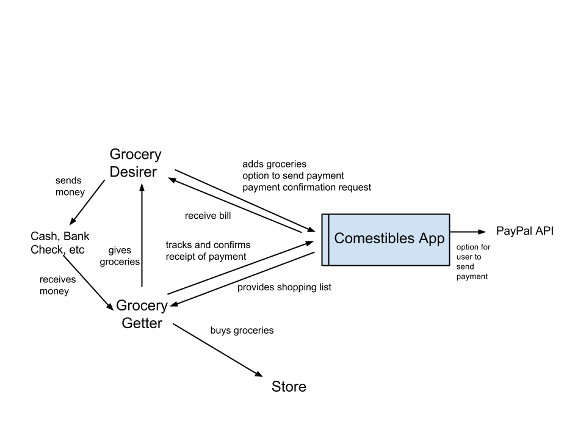
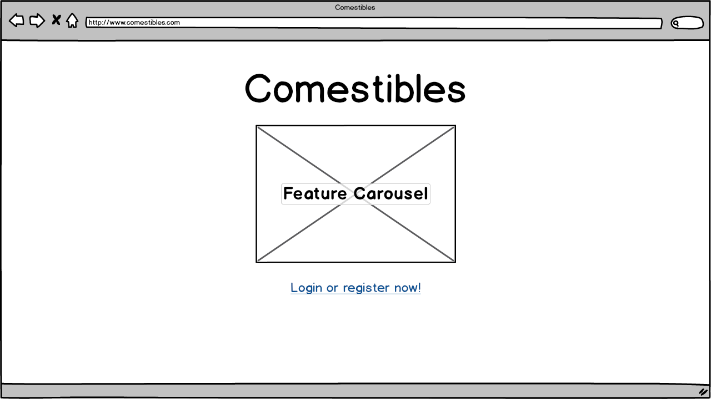
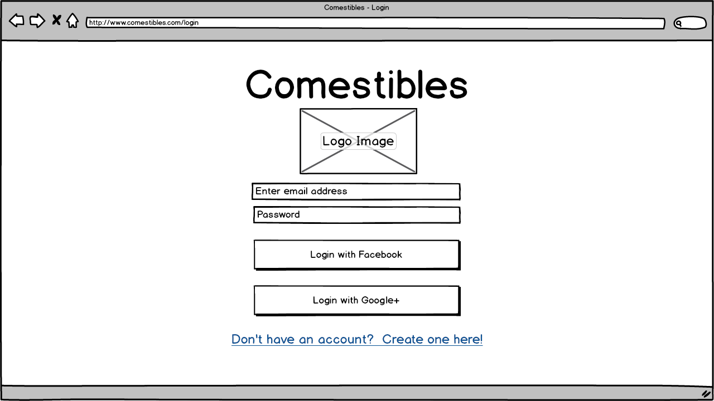
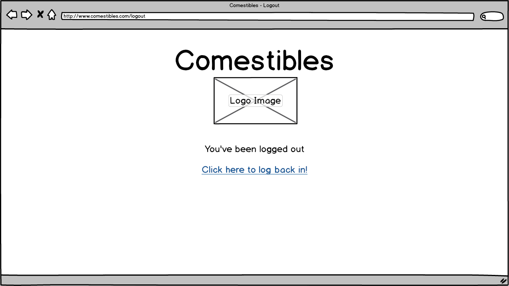
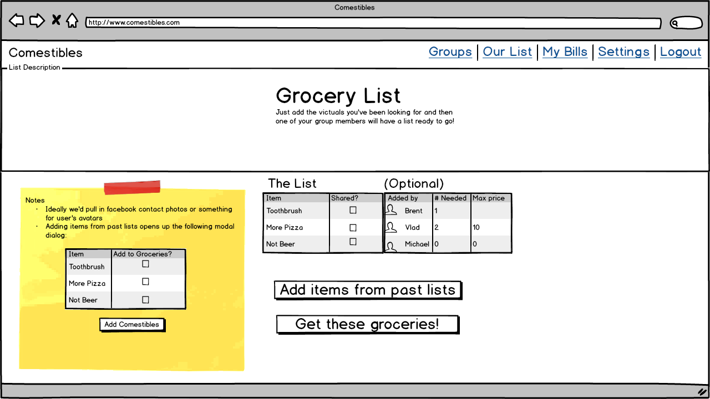
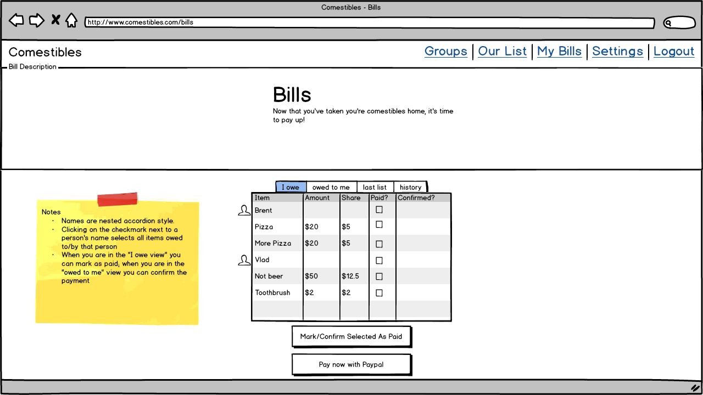
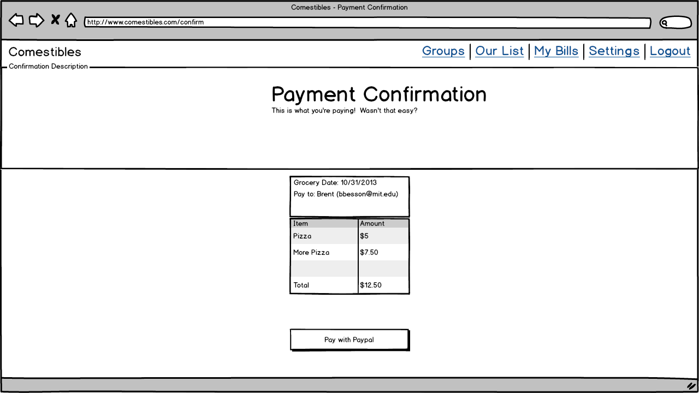
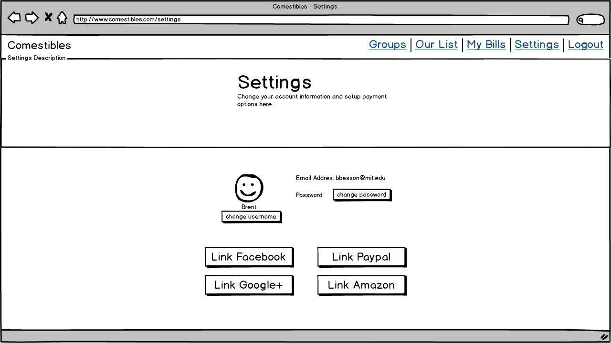
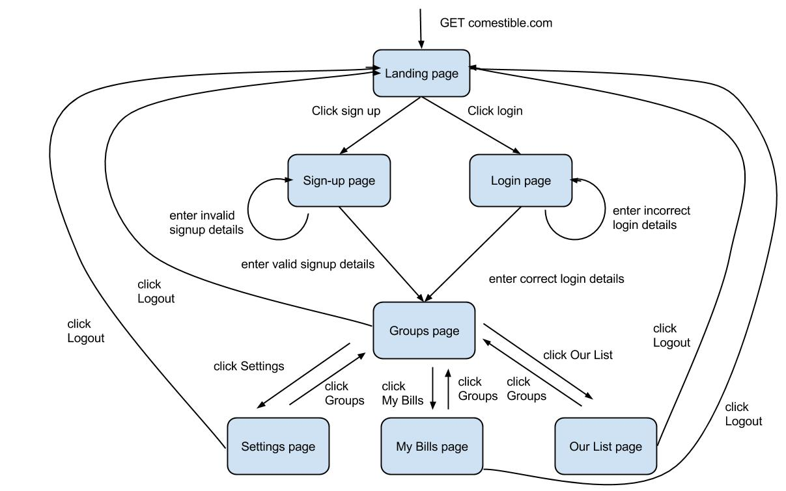

# Comestibles Design Summary

[Overview](#overview)  
    * Purpose and Goals  
    * Context Diagram (Lead: Michael)  
[Concepts](#concepts)  
    * Key Concepts  
    * Data Model (Lead: Michael)  
[Behavior](#behavior)  
    * Feature Descriptions  
    * Security Concerns  
    * User Interface  
        * wireframes (lead: Brent)  
        * flow between pages (lead: Vlad)  
[Challenges](#challenges)  
    * Design Challenges  
[Brainstorming](#brainstorming)  

## Overview

### Purpose and Goals

Buying groceries is a pain in the ass. Every week. The problem only gets worse when you’re trying to buy groceries for a large group. Comestible makes shared groceries easy.

Comestibles allows groups of users to make a shared grocery list and designate items as individual or shared by the group. The person who does the grocery run can then take the list, and put prices back onto the app, charging each person per item by dividing up shared expenses and charging individual expenses. The grocery runner can then confirm receipt of payments through the app and the other group members can see owed payments.

Other possible names: victuals, vittles

### Context Diagram (Lead: Michael)

Who:

* a group of users, friends, family members, etc.
* request shared and individual items
* grocery getter: sets the prices after getting groceries

What: 

* Getting groceries.  
* List of groceries and their properties (who will pay, how many)

Enables:

* Splitting expenses
* Verifying items purchased
* Verifying payment

## Concepts

### Key Concepts

* Grocery Getter: the person who purchases the groceries and foots the total bill at the store

* Grocery Desirer: Has an name and password. There are two types of buyers:
    * Individual: the person who pays the grocery getter for an item he or she ordered for individual use or consumption
    * Group: expenses from some items (such as laundry detergent) are shared evenly among the entire group

* Grocery List: contains many Grocery items

* Grocery Items
    * Cost
    * Name
    * Description
    * Owner (including shared)
    * Multiplicity

* Purchase and Payment verification: what was requested, what was purchased, what was paid for, what payments have been confirmed
* option to pay offline or through Comestible with Paypal API

* Nagging: auto-nag people to actually buy and pay for groceries

### Data Model (Lead: Michael)

## Behavior

### Feature Descriptions

* sign-up, log-in, sign-out functionality
* group memberships, group creation, manage memberships in groups
* grocery lists -> have an active grocery list
* add grocery items to active grocery list -> shared and individual
* grocery getter confirms list, items marked as shared or individual
* finalize list when grocery getter goes to the store -- no more modifications allowed
* grocery getter confirms what was bought and the price
* application divides bill according to shared/individual items
* show grocery users “bill” and who owes what
* track getting reimbursed
* push unbought items into next active list
* each grocery user can view payments due and charges due

### Security Concerns

#### Requirements
* Only members of a group can see any of the groups carts
* Only members of a group can see items in that cart.

#### Risks
* Friends might be curious about what other group's grocery lists look like.
* Dishonest users may claim that they have paid for items that they haven't actually paid for.
* Spammers may try to join groups and add spam items to the group's carts.
* Hackers may try to steal users's login information.

#### Threat model
* We can assume that dishonest users are very likely.
* We assume that spammers are very likely.
* We can assume that hackers who are trying to steal basic credentials or who are attempting to do XSS/CSRF attacks are very likely.
* We assume that there is no interest from sophisticated hackers because we do not store important user information and no money exchanges hands in our system.

#### Mitigation
* To mitigate against curious friends or dishonest users
    * We verify that a user is logged in before they can access anything other than the login or create new account screen.
    * We verify that a user is a member of a group before they can see any information about that group.
    * We have a two step verification process to confirm that someone has paid for a good: first they claim they have paid, and then the purchaser verifies that they have paid.
* To mitigate against spammers, we made it so that users cannot join arbitrary groups; only a group's creator can add group members.
* To mitigate against hackers
    * We use ssl (in production).
    * We store salted and hashed passwords (using bcrypt).
    * We use Rail's built in protection against XSS (and we never use Rail's .html_safe or .raw methods)
    * To prevent database attacks we use Rail's ORM to access our database and never use SQL string manipulation.
    * We are using Rail's built in protection against CSRF

### User Interface

#### Wireframes (lead: Brent)

##### Landing Page

##### Login

##### Logout

##### Groups

##### Grocery List

##### Bills

##### Payment Confirmation

##### Settings

#### Wireframe state machine (lead: Vlad)

## Challenges

### Design Challenges

The main design challenges our team faced was determining how to implement shared grocery lists, shared grocery items, and bill calculation.  We decided to use an entity collecting sets, `group_memberships`, `group_carts`.  For tracking items in a cart and for tracking bills, we use rail's has_many relationship.

List of problems to resolve in concepts, behaviors or implementation:

* Separating carts and corresponding lists for different groups
    * We could have created a groups model and associated exactly one cart, creating the need for another object to include in the data model.
    * Instead we decided to have carts be standalone and allow
        * Separation functionality to be completed in the final product (MVP functionality allows users to access all carts)
* Ading products, prices, and items
    * Could have users add items to a list and the person who buys groceries add all the prices at once
        * Messy, it’s nicer to have a well-defined set of products that users can define and then add to carts set
    * We chose to have users create ‘Products’ with prices that they could add as items to different lists 
        * Cleaner interface, cleaner conceptually to have a bank of defined products that people can add to lists
* Carts need to be able to be finalized at some point, for example when the grocery runner gets groceries or the transaction is completed
    * Could create another object that’s a finalized cart
    * But we lock it by making it so that nothing in the cart can be edited when it is finalized 
* Splitting bill across the users
    * People often need to split bills when buying something like groceries and we wanted there to be a way for users to distinguish between personal items and items split between the group
    * We could have solved this by having a flag in the Item model that tells us whether it is shared or not, but we decided to implement this with an object so that we could have greater freedom with what to do with it, for example being able to have a view by category within a list.
    * The tabulation is then simple arithmetic across each cart when it is finalized
* Creating user logins
    * User login and session functionality was added after we completed the core cart and product functionality
    * Sessions and login could be done in a parallel manner to our application, but we decided to integrate it on every page for usability and cleanliness of flow
* We abstracted away the core of our application into a cart, a product, and an item. We made the design decision for users to have a list of products to choose from when adding to a cart to make the application more consistent. This became the “Product” model. We needed a container to hold actual things to buy and separate between groups (the “Cart”), as well as the objects actually listed in these containers (an “Item”).
* In the schema design, we currently have “Categories” that Products are classified under. In the current MVP, we classify each product as belonging to the category “1”, which may seem to make the classification superfluous. We chose this design to facilitate our final implementation which will allow products to be classified as Shared or Individual.
* For the MVP, our schema  is relatively unsophisticated and may seem simplistic. Indeed, it lacks much of the inter-data relationships that we plan to implement for our final version so that the web application is useful to a wider audience that a single “focus group”. Therefore, in our final version, there will be more associations as we implement restrictions and invitations to carts. We believe our MVP schema provide an excellent starting point for this.

Paring down the features
