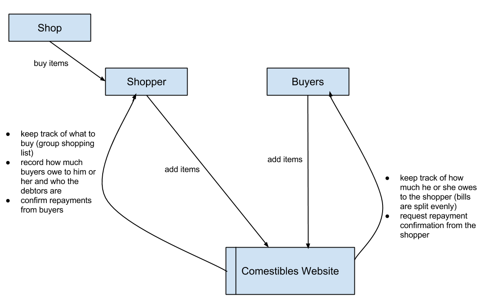
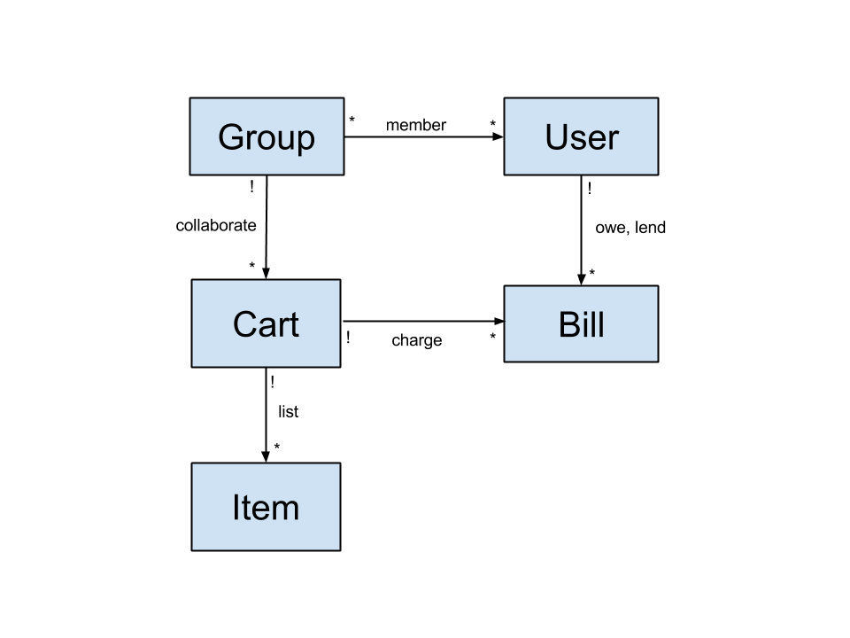

# Comestibles Design Summary

[Overview](#overview)  
    * Purpose and Goals  
    * Context Diagram (Lead: Michael)  
[Concepts](#concepts)  
    * Key Concepts  
    * Data Model (Lead: Michael)  
[Behavior](#behavior)  
    * Feature Descriptions  
    * Security Concerns  
    * User Interface  
        * wireframes (lead: Brent)  
        * flow between pages (lead: Vlad)  
[Challenges](#challenges)  
    * Design Challenges  
[Brainstorming](#brainstorming)  

## Overview

### Purpose and Goals

Buying groceries is a pain in the ass. Every week. The problem only gets worse when you’re trying to buy groceries for a large group. Comestible makes shared groceries easy.

Comestibles allows groups of users to make a shared grocery list and designate items as individual or shared by the group. The person who does the grocery run can then take the list, and put prices back onto the app, charging each person per item by dividing up shared expenses and charging individual expenses. The grocery runner can then confirm receipt of payments through the app and the other group members can see owed payments.

Other possible names: victuals, vittles

### Context Diagram (Lead: Michael)

Who:

* a group of users, friends, family members, etc.
* request shared and individual items
* grocery getter: sets the prices after getting groceries

What: 

* Getting groceries.  
* List of groceries and their properties (who will pay, how many)

Enables:

* Splitting expenses
* Verifying items purchased
* Verifying payment

## Concepts

### Key Concepts

* Users: people who desire their lives to be made easier by splitting shared expenses of items
* Groups: allows users to organize their spending lives along the lines of groups they share expenses with
* Carts: allows groups to create more carts (that become finalized when items are bought) as time goes on
* Items: the items that are desired are put into respective carts including their name, cost, and multiplicity
* Bills: splits shared expenses evenly across group, track and confirm payments of shared expenses

### Data Model (Lead: Michael)

## Behavior

### Feature Descriptions

* Users can create groups to separate out the people in their lives who they share expenses with
* Groups can have multiple carts for multiple shopping lists as time passes
* Groups can finalize lists when the items are bought
* Group owner and administrator can confirm proper payments from shared expenses
* Bills are divided evenly among users and the app tracks payments to the group owner 
* Users can view payments due and charges due

### Security Concerns

#### Requirements
* Only members of a group can see any of the groups carts
* Only members of a group can see items in that cart.

#### Risks
* Friends might be curious about what other group's grocery lists look like.
* Dishonest users may claim that they have paid for items that they haven't actually paid for.
* Spammers may try to join groups and add spam items to the group's carts.
* Hackers may try to steal users's login information.

#### Threat model
* We can assume that dishonest users are very likely.
* We assume that spammers are very likely.
* We can assume that hackers who are trying to steal basic credentials or who are attempting to do XSS/CSRF attacks are very likely.
* We assume that there is no interest from sophisticated hackers because we do not store important user information and no money exchanges hands in our system.

#### Mitigation
* To mitigate against curious friends or dishonest users
    * We verify that a user is logged in before they can access anything other than the login or create new account screen.
    * We verify that a user is a member of a group before they can see any information about that group.
    * We have a two step verification process to confirm that someone has paid for a good: first they claim they have paid, and then the purchaser verifies that they have paid.
* To mitigate against spammers, we made it so that users cannot join arbitrary groups; only a group's creator can add group members.
* To mitigate against hackers
    * We use ssl (in production).
    * We store salted and hashed passwords (using bcrypt).
    * We use Rail's built in protection against XSS (and we never use Rail's .html_safe or .raw methods)
    * To prevent database attacks we use Rail's ORM to access our database and never use SQL string manipulation.
    * We are using Rail's built in protection against CSRF

### User Interface

#### Wireframes (lead: Brent)

##### Landing Page

##### Login

##### Logout

##### Groups

##### Grocery List

##### Bills

##### Payment Confirmation

##### Settings

#### Wireframe state machine (lead: Vlad)

## Challenges

### Design Challenges

The main design challenges our team faced was determining how to implement shared grocery lists, shared grocery items, and bill calculation.  We decided to use an entity collecting sets, `group_memberships`, `group_carts`.  For tracking items in a cart and for tracking bills, we use rail's has_many relationship.

List of problems to resolve in concepts, behaviors or implementation:

* Separating carts and corresponding lists for different groups
    * We could have created a groups model and associated exactly one cart, creating the need for another object to include in the data model.
    * Instead we decided to have carts be standalone and allow
        * Separation functionality to be completed in the final product (MVP functionality allows users to access all carts)
* Adding products, prices, and items
    * We could to have users create pre-defined ‘Products’ with prices that they could add as items to different lists 
    * We chose instead to have users add items and prices to a list which becomes conceptually simpler, and keeps the list of pre-defined products from getting too large, eventually requiring a search feature
* Carts need to be able to be finalized at some point, for example when the grocery runner gets groceries or the transaction is completed
    * Could create another object that’s a finalized cart
    * But we lock it by making it so that nothing in the cart can be edited when it is finalized 
* Splitting bill across the users
    * People often need to split bills when buying something like groceries and we wanted there to be a simple way to share costs
    * The tabulation is then simple arithmetic across each cart when it is finalized
    * For who pays the bill, we currently assume the owner of the group paid the bill.  We made this choice in the interest of expediency.
* Creating user logins
    * User login and session functionality was added after we completed the core cart and product functionality
    * Sessions and login could be done in a parallel manner to our application, but we decided to integrate it on every page for usability and cleanliness of flow
* We abstracted away the core of our application into a cart and an item. We needed a container to hold actual things to buy and separate between groups (the “Cart”), as well as the objects actually listed in these containers (an “Item”).
* We could have elaborate, predefined "Categories" and "Products."  This would may make finding specific products easier; however, we decided that the UX impairment was not worth these features.
* We had mutliple options for how to implement our data model
    * We chose to use connecting sets `group_memberships` and `group_carts`
    * We could have used Rail's has_and_belongs_to_many association, however we wanted the capability to extend the intermediate connecting set with additional methods and to more thoroughly test our application.
