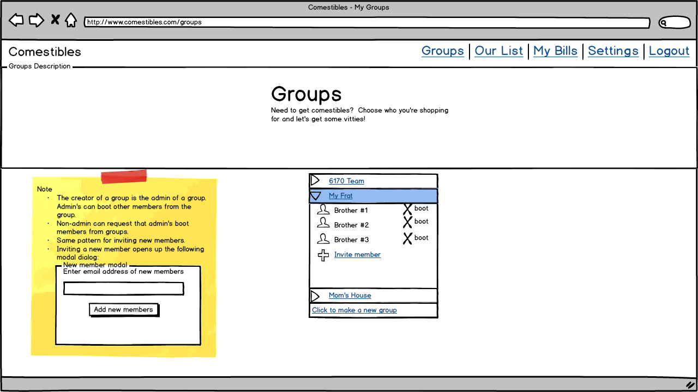

# Comestibles Design Summary

[Overview](#overview)  
    * Purpose and Goals  
    * Context Diagram (Lead: Michael)  
[Concepts](#concepts)  
    * Key Concepts  
    * Data Model (Lead: Michael)  
[Behavior](#behavior)  
    * Feature Descriptions  
    * Security Concerns  
    * User Interface  
        * wireframes (lead: Brent)  
        * flow between pages (lead: Vlad)  
[Challenges](#challenges)  
    * Design Challenges  
[Brainstorming](#brainstorming)  

## Overview

### Purpose and Goals

Buying groceries is a pain in the ass. Every week. The problem only gets worse when you’re trying to buy groceries for a large group. Comestible makes shared groceries easy.

Comestibles allows groups of users to make a shared grocery list and designate items as individual or shared by the group. The person who does the grocery run can then take the list, and put prices back onto the app, charging each person per item by dividing up shared expenses and charging individual expenses. The grocery runner can then confirm receipt of payments through the app and the other group members can see owed payments.

Other possible names: victuals, vittles

### Context Diagram (Lead: Michael)

Who:

* a group of users, friends, family members, etc.
* request shared and individual items
* grocery getter: sets the prices after getting groceries

What: 

* Getting groceries.  
* List of groceries and their properties (who will pay, how many)

Enables:

* Splitting expenses
* Verifying items purchased
* Verifying payment

## Concepts

### Key Concepts

* Grocery Getter: the person who purchases the groceries and foots the total bill at the store

* Grocery Desirer: Has an name and password. There are two types of buyers:
    * Individual: the person who pays the grocery getter for an item he or she ordered for individual use or consumption
    * Group: expenses from some items (such as laundry detergent) are shared evenly among the entire group

* Grocery List: contains many Grocery items

* Grocery Items
    * Cost
    * Name
    * Description
    * Owner (including shared)
    * Multiplicity

* Purchase and Payment verification: what was requested, what was purchased, what was paid for, what payments have been confirmed
* option to pay offline or through Comestible with Paypal API

* Nagging: auto-nag people to actually buy and pay for groceries

### Data Model (Lead: Michael)

## Behavior

### Feature Descriptions

* sign-up, log-in, sign-out functionality
* group memberships, group creation, manage memberships in groups
* grocery lists -> have an active grocery list
* add grocery items to active grocery list -> shared and individual
* grocery getter confirms list, items marked as shared or individual
* finalize list when grocery getter goes to the store -- no more modifications allowed
* grocery getter confirms what was bought and the price
* application divides bill according to shared/individual items
* show grocery users “bill” and who owes what
* track getting reimbursed
* push unbought items into next active list
* each grocery user can view payments due and charges due

### Security Concerns

Real security:

* authentication

Misuse:
* people misidentifying items as shared
* getter lying about prices
* buyers not reimbursing getter

### User Interface

#### Wireframes (lead: Brent)

##### Landing Page

##### Login

##### Logout

##### Groups

##### Grocery List

##### Bills

##### Payment Confirmation

##### Settings

#### Wireframe state machine (lead: Vlad)

## Challenges

### Design Challenges

Paring down the features
