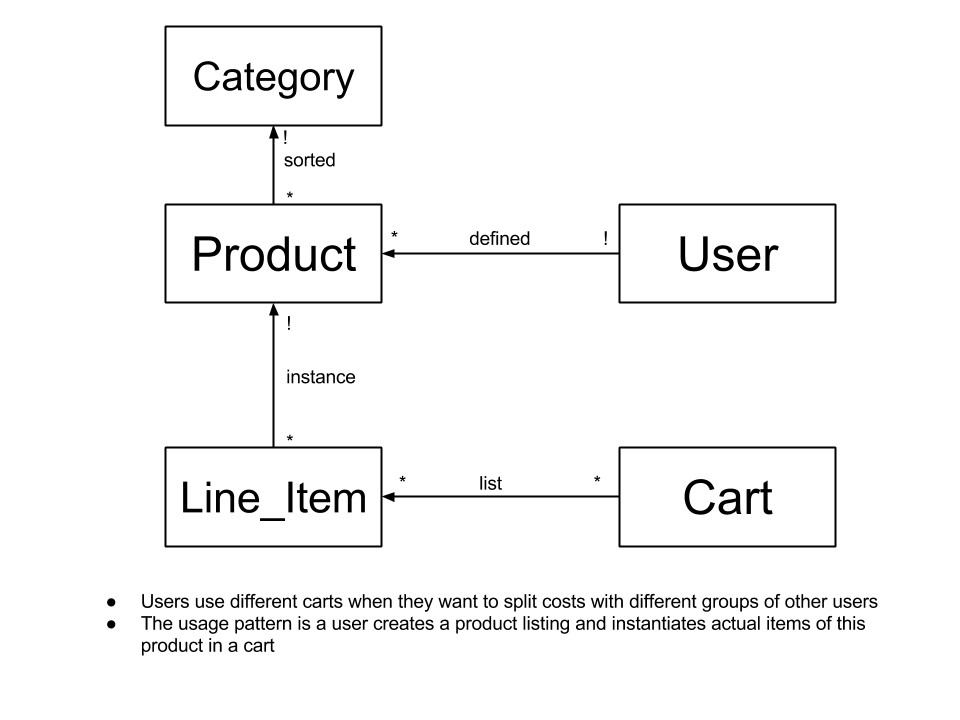

# Teamwork

This is a stub for the Teamwork writeup.  The only section that is required for 3.2 is the MVP subsection of Plan.

## Plan

### MVP

Our MVP implements the minimal basic functionality of the application. We boiled down the essence of our application into the ability for users to create shopping lists, add items and prices to a list, and split the cost among users. 

Under the current implementation, anyone with an access to the url has full access to the site: adding and editing products, as well as modifying carts, and marking them as finalized. In addition, the current implementation requires high degree of trust between the users as there is currently no way of tracking who owes how much and to whom. Therefore, the MVP is intended for a single group of individuals who mutually trust one another. We believe this is a reasonable assumption. First, it is unlikely that someone who does not know the url would accidentally stumble upon it online. Second, since the group of intended users is ourselves, we anticipate to learn about what needs to be improved and implemented so that the product is more useful to a wider audience.

#### Data Model

Key differences (compared to our [original data model](diagrams/Data-Model.png):

* Got rid of ‘Shared grocery item’ subclass as well as ‘Group’ concept
* Renamed ‘Grocery Desirer’ to ‘User’
* Renamed ‘Active Grocery List’ to ‘Cart’
* Changed ‘Grocery Item’ to ‘Item’ and classed its abstraction as a ‘Product’ 

#### Features

The subset of features that we have included in our minimum viable product are:

* Simple user interface
* User accounts and login, logout  (sessions)
* Different shopping carts to which users can add items
* Ability to create products with prices and add them to shopping carts
* Finalizing a shopping cart
* Splitting up cost among users who contributed to the cart

The issues we postponed include:
* A super slick UI
* Security mitigations
* We do not confirm user’s email addresses via email
* We have no way for users to reset their passwords
* Individual vs shared items distinction in carts
* Individual ‘profile pages’ where users could see how much money they owe to other users and how much money is owed to them
* Allocate bill taking into account individual and shared items
* Limit access of carts to users who are invited
* Paypal API integration

Now that we have the core of the application intact, including the users, sessions, bill-splitting and cart, product, item abstractions, adding on the final touches will be incremental. The most important core features to add are restricting permission to edit and view carts to those a user is invited to as well as the ability to categorize items as shared or individual and split up the bill accordingly. We have provided a solid base upon which to implement these as well as spiff up the UI and add PayPal API integration.

Users will be able to extract value out of this application to create desired products, create lists with each other, and split the value of the cart among each other to tabulate expenses.

There is a [link](https://docs.google.com/forms/d/19kJBLD7IyIix-7LOOcgiyWHfBxmfuKL-IhjSrZo1PIo/edit) to the feedback form the web application navigation bar so gather user comments and criticism.

#### MVP Design Challenges

The main design challenges our team faced was determining how to implement shared grocery lists, shared grocery items, and bill calculation.  We decided to use an entity collecting set, “line-items” to capture the many to many relationship between grocery lists and products.

List of problems to resolve in concepts, behaviors or implementation:
Separating carts and corresponding lists for different groups
We could have created a groups model and associated exactly one cart, creating the need for another object to include in the data model
Instead we decided to have carts be standalone and allow
Separation functionality to be completed in the final product (MVP functionality allows users to access all carts)
Adding products, prices, and items
Could have users add items to a list and the person who buys groceries add all the prices at once
Messy, it’s nicer to have a well-defined set of products that users can define and then add to carts set
We chose to have users create ‘Products’ with prices that they could add as items to different lists 
Cleaner interface, cleaner conceptually to have a bank of defined products that people can add to lists
Carts need to be able to be finalized at some point, for example when the grocery runner gets groceries or the transaction is completed
Could create another object that’s a finalized cart
But we lock it by making it so that nothing in the cart can be edited when it is finalized 
Splitting bill across the users
People often need to split bills when buying something like groceries and we wanted there to be a way for users to distinguish between personal items and items split between the group
We could have solved this by having a flag in the Item model that tells us whether it is shared or not, but we decided to implement this with an object so that we could have greater freedom with what to do with it, for example being able to have a view by category within a list.
The tabulation is then simple arithmetic across each cart when it is finalized
Creating user logins
User login and session functionality was added after we completed the core cart and product functionality
Sessions and login could be done in a parallel manner to our application, but we decided to integrate it on every page for usability and cleanliness of flow
We abstracted away the core of our application into a cart, a product, and an item. We made the design decision for users to have a list of products to choose from when adding to a cart to make the application more consistent. This became the “Product” model. We needed a container to hold actual things to buy and separate between groups (the “Cart”), as well as the objects actually listed in these containers (an “Item”).
In the schema design, we currently have “Categories” that Products are classified under. In the current MVP, we classify each product as belonging to the category “1”, which may seem to make the classification superfluous. We chose this design to facilitate our final implementation which will allow products to be classified as Shared or Individual.
For the MVP, our schema  is relatively unsophisticated and may seem simplistic. Indeed, it lacks much of the inter-data relationships that we plan to implement for our final version so that the web application is useful to a wider audience that a single “focus group”. Therefore, in our final version, there will be more associations as we implement restrictions and invitations to carts. We believe our MVP schema provide an excellent starting point for this.

